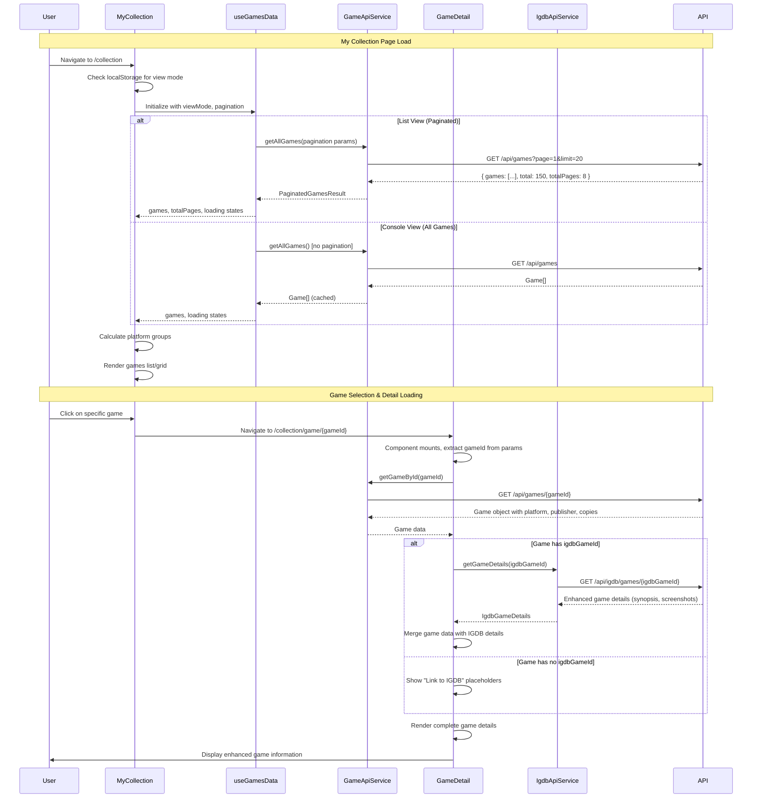

# Game Selection Workflow

This document outlines the complete workflow for navigating from the My Collection screen to viewing an individual game, including all API calls and state management.

## Overview

The game selection workflow follows a clean architecture pattern with clear separation between presentation, application, and infrastructure layers. The flow involves multiple components working together to provide a seamless user experience.

## Workflow Steps

### 1. My Collection Page Load
- User navigates to `/collection`
- MyCollection component mounts
- Authentication check occurs
- Games data loading begins

### 2. Games Data Loading
- useGamesData hook triggers based on view mode
- API call to `/api/games` (paginated or full)
- Games list populates with platform grouping
- Console view calculates platform statistics

### 3. Game Selection
- User clicks on a specific game in the list/grid
- Navigation triggers to `/collection/game/{gameId}`
- GameDetail component mounts

### 4. Game Detail Loading
- Individual game API call to `/api/games/{gameId}`
- IGDB enhancement check (if igdbGameId exists)
- Enhanced details loading from IGDB API
- Complete game information display

## Architecture Components

### Frontend Components
- **MyCollection**: Main collection page with view modes
- **useGamesData**: Custom hook for games data management
- **usePagination**: Pagination state management
- **GamesTable/ConsolesGrid**: Display components
- **GameDetail**: Individual game details page

### API Services
- **GameApiService**: Main games CRUD operations
- **IgdbApiService**: IGDB integration for enhanced details
- **AuthService**: Authentication and token management

## Detailed Workflow Diagram



## API Endpoints Used

### Games Collection
- **GET** `/api/games` - Fetch all games (console view)
- **GET** `/api/games?page={page}&limit={limit}&search={term}` - Paginated games (list view)

### Individual Game
- **GET** `/api/games/{gameId}` - Fetch specific game details

### IGDB Enhancement
- **GET** `/api/igdb/games/{igdbGameId}` - Fetch enhanced details from IGDB

## State Management

### MyCollection Component State
```typescript
- searchValue: string               // Search filter
- viewMode: 'list' | 'console'     // View mode (persisted in localStorage)
- games: Game[]                     // Games from useGamesData hook
- loading: boolean                  // Loading state
- error: string | null              // Error state
- pagination: PaginationState       // Pagination controls
```

### GameDetail Component State
```typescript
- game: Game | null                 // Main game data
- loading: boolean                  // Game loading state
- error: string | null              // Game error state
- igdbDetails: IgdbGameDetails | null  // Enhanced IGDB data
- igdbLoading: boolean              // IGDB loading state
- igdbError: string | null          // IGDB error state
- activeTab: 'details' | 'copies'   // Tab selection
```

## View Modes

### List View (Paginated)
- Loads 20 games per page
- Server-side pagination
- Search functionality
- Faster initial load
- Best for large collections

### Console View (Full Load)
- Loads all games at once
- Client-side grouping by platform
- Platform statistics calculation
- Games cached for performance
- Best for browsing by console

## Caching Strategy

### useGamesData Caching
- **Console View**: Games cached in `allGamesCache` state
- **Subsequent Loads**: Uses cached data instead of API calls
- **Cache Invalidation**: Component unmount or view mode change

### Performance Optimizations
- **Pagination**: Reduces initial load time
- **Memoization**: Platform calculations memoized
- **Conditional Loading**: IGDB details only when needed
- **Error Boundaries**: Graceful error handling

## Error Handling

### Network Errors
- API failures display user-friendly messages
- Retry mechanisms for transient failures
- Graceful degradation when IGDB unavailable

### Data Validation
- Type safety with TypeScript interfaces
- Runtime validation for API responses
- Default values for missing data

### User Experience
- Loading states prevent UI blocking
- Error messages provide actionable feedback
- Skeleton loading for better perceived performance

## Related Workflows

- **[Add Game Flow]**: Creating new games in collection
- **[Link to IGDB Flow]**: Enhancing games with IGDB data
- **[Edit Game Flow]**: Modifying existing game details
- **[Platform Management]**: Configuring console/platform mappings

## Technical Notes

### Authentication Flow
- All API calls require valid JWT token
- Token refresh handled automatically
- Unauthenticated users redirected to login

### Route Structure
```
/collection                           -> MyCollection (all games)
/collection/console/{consoleName}     -> MyCollection (filtered by console)
/collection/game/{gameId}             -> GameDetail
/collection/game/{gameId}/link-igdb   -> LinkGameToIgdb
```

### Data Models
- **Game**: Core game entity with platform and publisher
- **Platform**: Console/system information with IGDB mapping
- **Publisher**: Game publisher/developer information
- **GameCopy**: Physical copy details (condition, pricing)
- **IgdbGameDetails**: Enhanced details from IGDB API